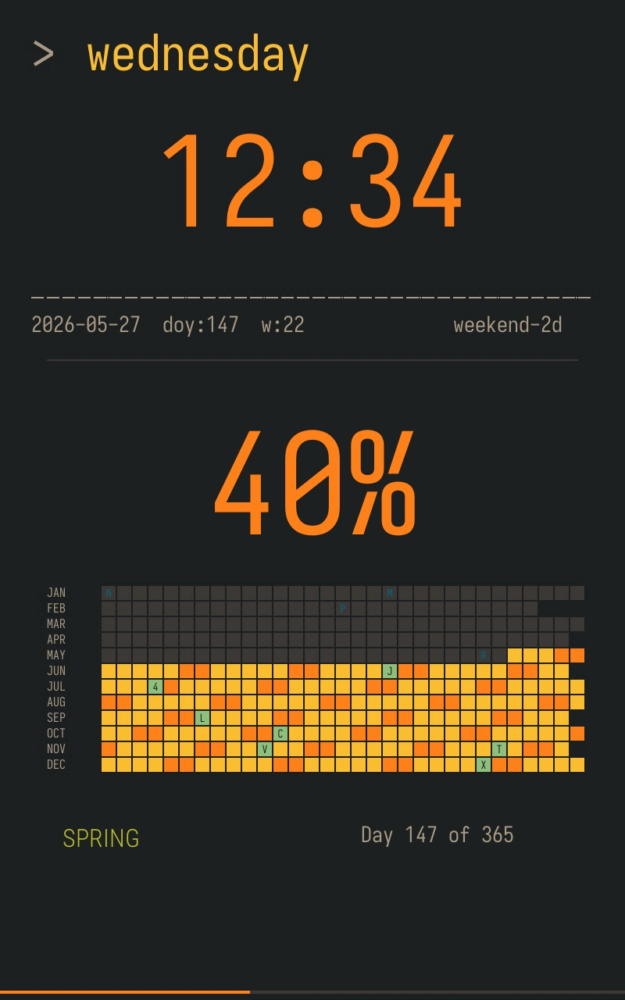
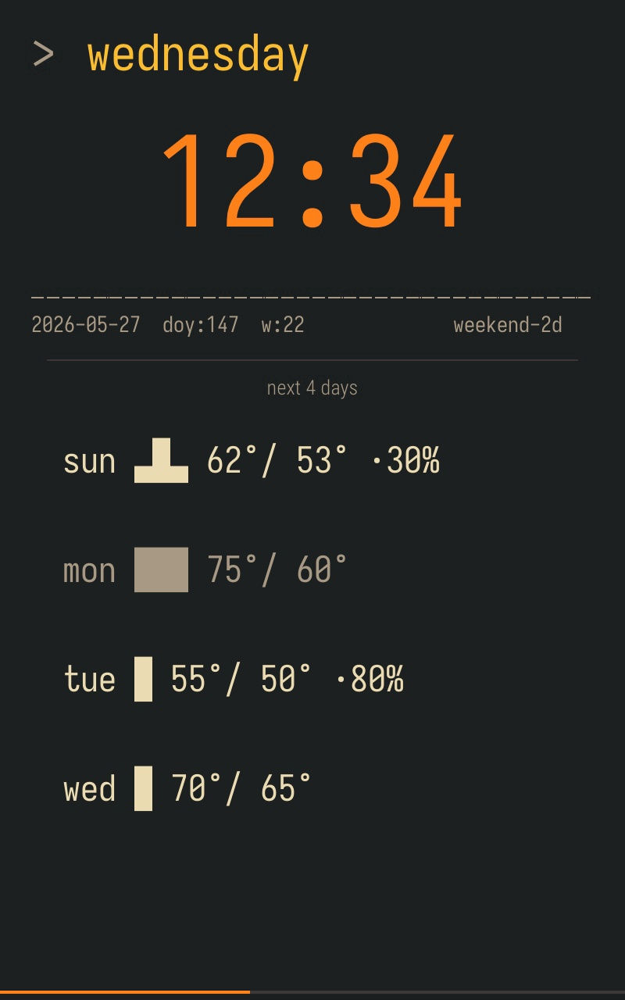
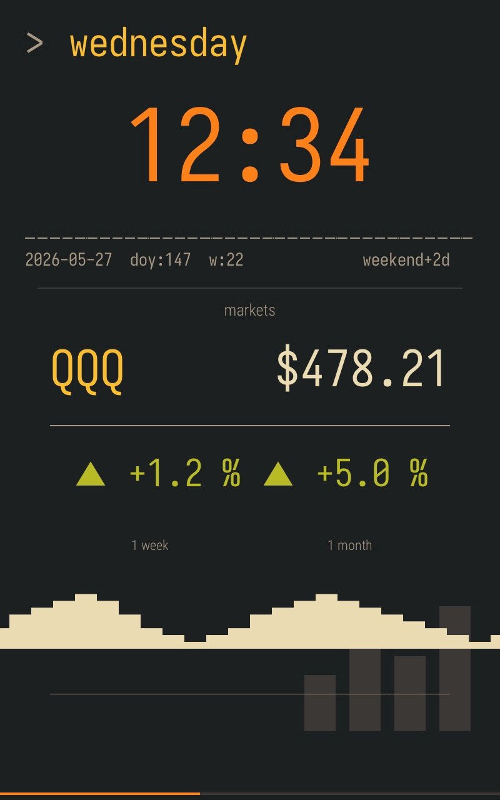
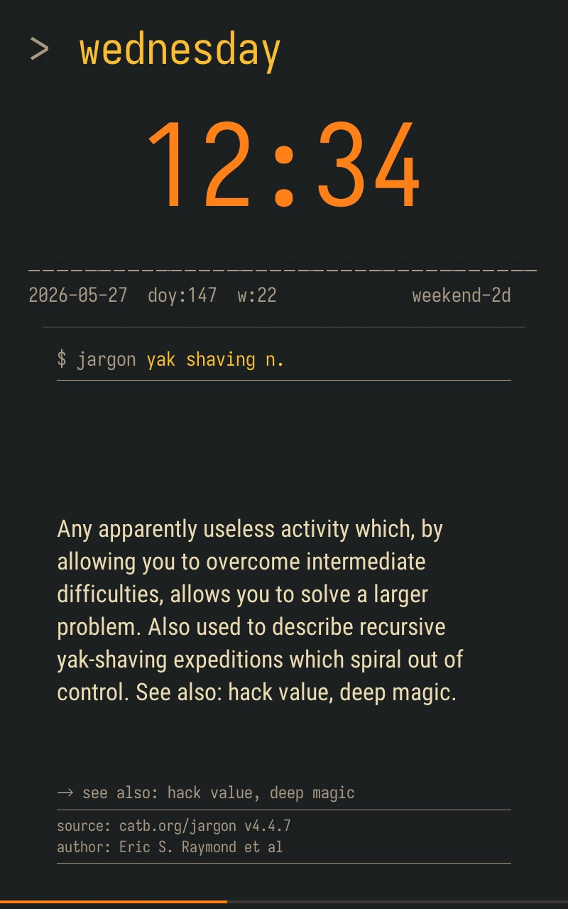
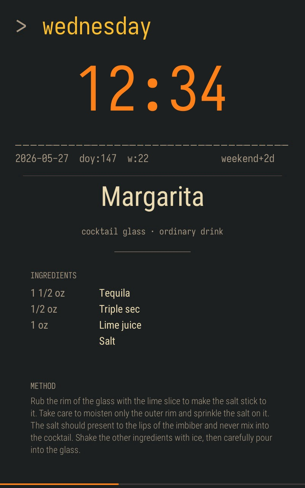
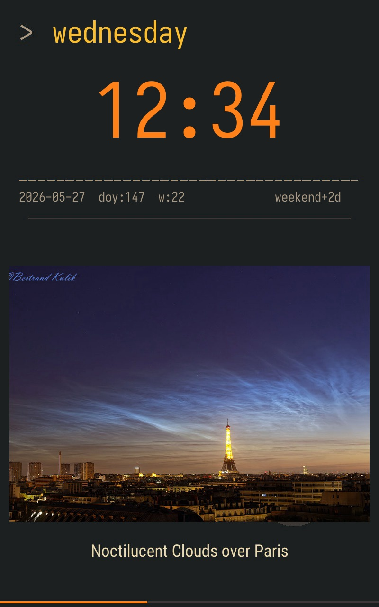

# divoom

A custom wall-clock dashboard for the Divoom Times Frame (800×1280 portrait),
built because the stock app's preset dials are restrictive and the device is
an Allwinner TinaLinux box that quietly accepts `adb` pushes and exposes a
local JSON HTTP API at `:9000/divoom_api`. The dashboard runs as a Docker
container on a NAS (with the frame USB-attached for adb), rotating every
three minutes through ~28 hand-designed scenes that mix market tickers,
weather + 4-day forecast + air quality + NWS alerts, sky / moon / ISS /
sunrise, calendar grid + agenda peek + pickup-day reminder, historical
events, hand-curated quotes, useless facts, HN headlines, a daily piece
of generative art, and a ~300-deep rotation of typographic cocktail
recipe cards + a 121-deep curated NASA APOD rotation.

### Highlights

<table>
<tr>
<td width="50%"></td>
<td width="50%"></td>
</tr>
<tr>
<td><b>calendar</b> — year-at-a-glance grid. Past cells uniform grey; future weekdays yellow, weekends orange; US federal holidays aqua + letter; <code>DIVOOM_SPECIAL_DATES</code> birthdays red + letter. Past markers fade to muted blue / red. Re-renders nightly.</td>
<td><b>forecast</b> — next 4 days with a unicode-block bar scaling each day's HI/LO range against the week's span, plus a <code>·NN%</code> precip suffix when ≥30%.</td>
</tr>
<tr>
<td></td>
<td></td>
</tr>
<tr>
<td><b>markets</b> — trading-terminal readout: symbol, price, week/month % badges, ~35-day Unicode sparkline.</td>
<td><b>jargon</b> — terminal-style dictionary chassis: <code>$ jargon &lt;headword&gt;</code> shell prompt, definition body, baked source/author footer.</td>
</tr>
<tr>
<td></td>
<td></td>
</tr>
<tr>
<td><b>cocktail</b> — random drink from a ~300-deep rotation rendered as a typographic recipe card.</td>
<td><b>nasa</b> — Astronomy Picture of the Day from a hand-curated pool of 121 iconic dates.</td>
</tr>
</table>

Browse every scene's baked chrome in [`docs/screenshots/`](docs/screenshots/).

## What this is

The Times Frame is a 10.1" 800×1280 portrait IPS LCD that ships with a locked
set of preset dials. Its undocumented-in-broken-English local HTTP API lets
us install a custom layout: one 800×1280 background image, plus up to 6 Text
+ 10 Image + 6 NetData elements layered on top, plus built-in Time / Date /
Week / Mday / MonYear / Weather / Temperature blocks (special types — each
has its own quota and doesn't count against the 6-Text cap).

Because the device's image fetcher is cloud-proxied (it can't reach LAN URLs
and silently whitelists only `f.divoom-gz.com` for `Image` element URLs), we
don't try to host endpoints the frame polls. Instead the daemon:

1. Discovers the frame on the LAN (or talks directly to `DIVOOM_FRAME_IP`).
2. `adb`-pushes per-scene background JPGs into `/userdata/` on the device
   over USB. The NAS container runs `--privileged` with `/dev/bus/usb`
   bind-mounted, so the same image that serves the rotation also performs
   the pushes — no separate dev-box step. The NASA + cocktail scenes
   pre-bake every entry in their rotation pool into individual indexed
   bg JPGs so the device can show variety without ever touching the
   network at activation time. The calendar + generative-art scenes
   re-render and re-push at every local midnight via an in-process
   scheduler so "today" stays current.
3. Runs each widget (weather, markets, moon, whimsy rotator, …) in-process
   on its own refresh cadence, caching the last value.
4. Rotates through scenes every 3 minutes: at each scene change it bakes
   the current widget values into Text elements and installs the whole
   layout via `Device/EnterCustomControlMode`. Per-scene `WeightModifier`
   closures scale rotation weight by time-of-day so the right scene is
   more likely to fire at the right hour (markets during market hours,
   sunrise around the actual event, NASA APOD overnight, etc.).

## Scenes

| Scene | What it shows |
|---|---|
| **markets** | Trading-terminal readout — symbol + price, week/month % badges with arrow + colour, ~35-day sparkline. `DIVOOM_TICKERS` rotates one symbol per activation. |
| **weather** | Big temperature (colour-banded by climate-normals-fitted thresholds), bottom strip with outlook + AIR / HUM / RAIN bound to AQI band, or "⚠ NWS alert" in red when one fires. Sources: Open-Meteo forecast + air-quality + NWS. |
| **sunrise** | Today's sunrise / sunset times + daylight hours. |
| **moonphase** | The current phase rendered as a real disc (one of 14 pre-rendered variants across the synodic cycle) + name + illumination + countdown to next full moon. |
| **iss** | Live sub-satellite-point dot drawn over a baked world-map outline + altitude + velocity. |
| **calendar** | 12×31 calendar grid. Past cells uniform grey; today bordered yellow; future weekdays yellow, future weekends orange. Letter-marks: aqua + letter for US federal holidays, red + letter for `DIVOOM_SPECIAL_DATES` birthdays / anniversaries. Past holiday / personal-date letters use a faded blue / faded red so they read as muted markers against the grey backdrop. Polarity is "past muted, future colourful" — time flows down-and-right through the year. Re-renders + re-pushes at every local midnight so "today" stays current. |
| **forecast** | Next-4-day strip — one row per day with day-name, HI°/LO° tightened, a 6-char unicode-block bar showing the day's range scaled against the week's overall span, and a `·NN%` precipitation suffix when ≥30%. Row colour-coded by outlook (clear / cloudy / rain / snow / hazard). |
| **agenda** | Next 1-2 events from a public iCal feed (`DIVOOM_AGENDA_ICS_URL`) — event title hero with relative countdown (`in 23m`, `tomorrow`, `Thu`) and clock time. Opt-in; the scene drops out of rotation when the env var is unset. |
| **pickup** | Trash / recycling / compost reminder, fires from 17:00 the day before through 08:00 the morning of each pickup. `DIVOOM_PICKUP_SCHEDULE=trash:thu,recycle:thu` configures the cadence. Otherwise weight-0 and invisible from the rotation. |
| **genart** | A daily piece of generative art — voronoi tessellation / perlin contours / recamán's-sequence stripes / mandelbrot zoom, chosen deterministically per date. Re-renders at every local midnight. |
| **seismic** | Recent earthquakes within the configured radius — magnitude, distance, age, hypocenter depth. Source: USGS. |
| **catfacts** | Cat fact rendered as a Smithsonian-style field-guide entry — _Felis catus_ binomial, taxonomic line, pilcrow drop-marker, observation # / institution footer. |
| **didyouknow** | Random useless fact in body prose under a big bold "?" glyph. |
| **onthisday** | Historical event for today's date from Wikimedia — big orange year accent over the prose, tear-off-calendar glyph in the corner. |
| **til** | Top r/todayilearned post under a monumental "T I L" wordmark. |
| **easter** | (rare, weight 1 of ~480) Random whimsical one-liner printed dark-on-yellow _inside_ a cracked egg, with a "rare drop · ~1 in 200" caption. |
| **github** | Lifetime contributions (hero number, comma-separated, green) + three-column stat tile of total PRs / open PRs (cAqua when >0) / years on GitHub. |
| **hn** | Top Hacker News story filtered by keyword — title + domain + score / comments / author byline. |
| **reddit** | Top-of-day post from a randomly-chosen `DIVOOM_SUBREDDITS` entry — title hero, `r/<sub>` accent, link domain, ▲ score / byline / age / comments footer. |
| **nasa** | Astronomy Picture of the Day from a hand-curated pool of **121 iconic dates** (JWST releases, Hubble milestones, eclipses, Cassini, Pluto, EHT, …). One bake per date, indexed bg paths, shuffled per daemon start. |
| **cocktail** | Random drink from TheCocktailDB's Cocktail + Shot categories (~300 drinks) rendered as a typographic recipe card: drink name (huge), glass · category subhead, ingredient rows with measurements, wrapped method. Stable indexed paths, shuffled walk per daemon start. |
| **fortune / devil / wordnik / jargon** | Four dictionary / quote terminal layouts — `$ <cmd>` shell prompt + body + baked source/author footer. |
| **babylon5 / startrek / discworld** | Source-attributed quote scenes — from-source layout with attribution under the rule. |
| **stoics / twain / zenquotes** | Marginalia / page-of-a-book layout. |

Every scene's baked chrome is in [`docs/screenshots/`](docs/screenshots/) —
the dynamic Text overlays only show up once the frame installs the layout
live, so the bg-only renders look sparse for data-heavy scenes (markets,
weather, github). The cocktail + NASA scenes are fully baked, so their
screenshots match what you'd see on the wall.

## Architecture

One container does both jobs. `serve` runs forever (LAN HTTP to the
frame, widget polling, scene rotation). The same image carries `adb` +
`/dev/bus/usb` passthrough so `push` (full background + font refresh)
and the in-process daily refresh (calendar + genart) can adb-push to
the USB-attached frame without leaving the box.

```
  NAS container (privileged + /dev/bus/usb)            Times Frame
  ┌────────────────────────────────────┐     USB-adb   ┌──────────┐
  │ divoom serve  ─ scene rotation     │ ────bgs────▶  │ /userdata│
  │   ├─ widgets poll external APIs    │   + fonts     │          │
  │   ├─ daily refresh: midnight push  │               │          │
  │   │   of calendar + genart bgs     │     LAN HTTP  │ :9000    │
  │   └─ EnterCustomControlMode ──────────────────────▶│ JSON API │
  │ divoom push  ─ full bg + font reload (manual,      │          │
  │   crashes divoom_app to reload fonts)              │ 800×1280 │
  └────────────────────────────────────┘               │ IPS LCD  │
   ▲                                                   └──────────┘
   │  open APIs: Open-Meteo, NWS, USGS, NASA APOD,
   │  HN, Wikimedia, GitHub, TheCocktailDB, Stooq,
   │  Reddit, iCal feeds, …
```

`push` runs occasionally — after scene-design changes, font changes,
or factory resets — and ends with a font-install crash-restart of
divoom_app on the device (the only known way to reload `font_list.cfg`).
Don't wire `push` into the entrypoint: the crash-restart makes serve
unreachable for ~30s and produces an infinite container-restart loop
(see `docs/api.md` 2026-05-23). The in-process daily refresh handles
the date-sensitive scenes without touching fonts.

The NASA + cocktail bakes are slow (hundreds of HTTP fetches +
ImageMagick-style compositing + adb pushes per bake) but they're
fully cached under `~/.cache/divoom/` so subsequent pushes are
network-free. Widgets fetch from the open internet on their own
cadences; nothing on the frame ever reaches back into the LAN.

## Usage

```
go run ./cmd/divoom probe          # discover the frame, print current dial
go run ./cmd/divoom display test   # 30s gruvbox test layout, then restore
go run ./cmd/divoom display ticker # 30s ticker via UpdateDisplayItems
go run ./cmd/divoom render         # write scene JPGs to ./dist/scenes/
go run ./cmd/divoom push           # adb-push scene backgrounds + fonts (USB-attached host
                                   # only; NAS container with USB passthrough works too —
                                   # `docker exec divoom-dashboard divoom push`. Prereq:
                                   # scripts/download-fonts.sh once.)
go run ./cmd/divoom serve          # the dashboard daemon
```

Set `DIVOOM_FRAME_IP=<ip>` to skip cloud discovery and talk to a known device
directly (e.g. if you've firewalled the device off the public internet but
still want the daemon to reach it on the LAN). Set `DIVOOM_FRAME_MAC=<mac>`
to pin to a specific frame when you have more than one. See `.env.example`
for the full list of widget keys + deploy settings (NASA / GitHub / Wordnik
API keys, Portainer credentials, etc.).

A typical end-to-end deploy is `make` from the repo root, which builds the
container, pushes it to GHCR, redeploys the Portainer stack on the NAS, and
then runs `push-frame` to refresh scene backgrounds and fonts via adb.

## Docs

- [`docs/api.md`](docs/api.md) — empirical notes on the Times Frame API:
  endpoints we've used, quirks we've hit (the cloud-proxy URL whitelist,
  the per-type element caps, the element-property cache keyed on
  `(Type, position-in-DispList)` and the filler-element workaround,
  the Image-element Font-field requirement, the push-on-start
  anti-pattern), and pointers back into Divoom's broken-English
  upstream docs at `docs/upstream/`. The source of truth for "how does the
  device actually behave"; update it in the same commit as any change that
  exercises new behaviour.
- [`docs/scene-rules.md`](docs/scene-rules.md) — the constraints every
  scene must respect: 6-element layout cap, frozen-bg-at-deploy
  (except calendar + genart which refresh daily in-process), the
  device cache key, the typo-preservation rule, and the workflow
  conventions for adding new scenes.
- [`docs/deploy.md`](docs/deploy.md) — the GHCR + Portainer deploy workflow
  (`make deploy` from this checkout).
- [`CLAUDE.md`](CLAUDE.md) — engineering philosophy (distilled from
  Kanat-Alexander's *Code Simplicity*) that all changes in this repo are
  judged by: reduce maintenance over implementation, keep pieces small,
  no speculative generality.
